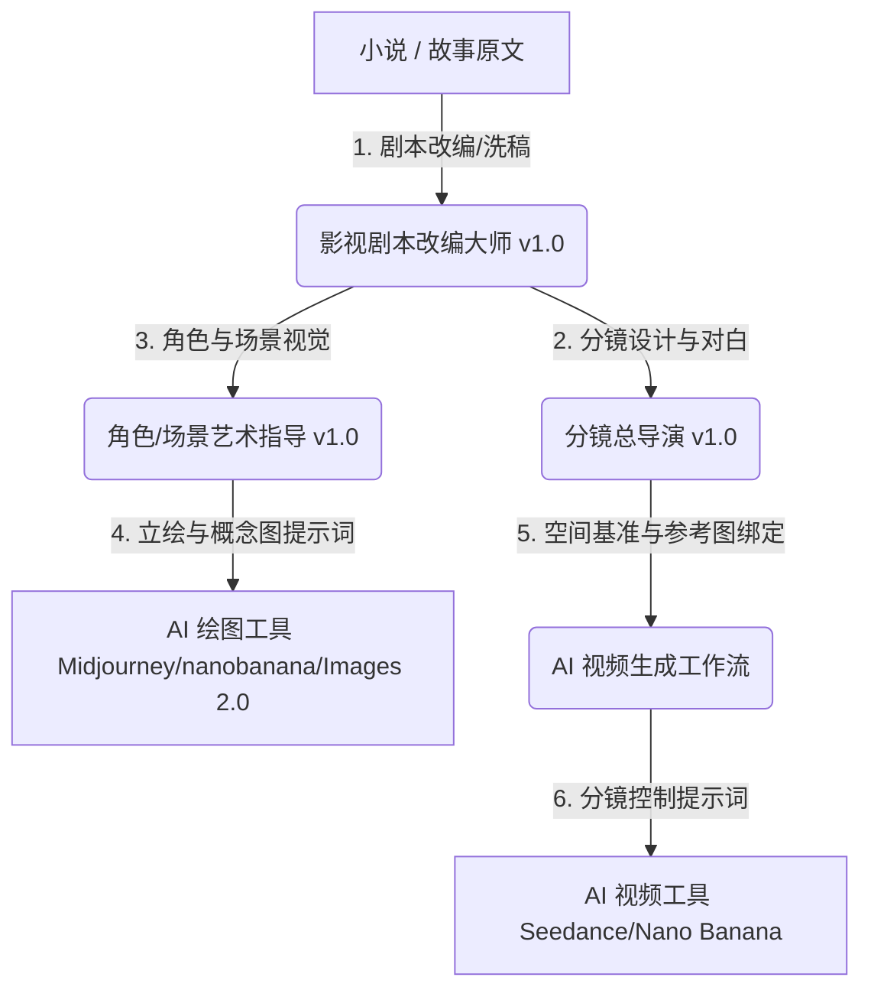

# Short-Drama AI Filmmaking Gems (v6.5)

[English](./README_EN.md) | 简体中文

这是一个专为**短剧（竖屏/横屏）、微电影、短视频**等影视创作设计的高级 AI 智能体指令（System Prompts / Gems）套件。该套件包含三个处于核心生态位的专业智能体，构成了从“小说/故事原文”到“AI 绘图/视频生成提示词”的工业级自动化控制管线。

特别适配于 **Seedance 2.0、Nano Banana、Midjourney、Stable Diffusion** 等主流 AI 视频/图像生成工具。

---

## 🎬 核心智能体介绍

本套件由以下三个 **v1.0 旗舰版** 智能体指令组成，每个文件都包含严格的执行铁律、工作流和状态跟踪锁（State Tracker）：

### 1. 影视剧本改编大师 
*   **角色定位**：专业级影视剧本改编专家，专注将小说/故事改编为符合影视拍摄标准的商用剧本。
*   **核心模块**：
    *   `步骤0：小说接收与全维度解析`（题材/人物/冲突识别、制作成本评估、集数建议）。
    *   `A1 原版剧本生成`（完整还原人设与剧情，标准单集剧本格式）。
    *   `A2 合规洗稿原创`（100%重写人设、场景、台词、细节，保障版权合规）。
    *   `剧情续写`（自动承接上一集结尾的悬念钩子进行内容拓展）。
*   **设计特色**：内置台词字数限制（单句≤25字）、节奏控制（短剧每30秒一个小反转）及强悬念钩子机制。

### 2. 角色/场景艺术指导 
*   **角色定位**：影视化视觉资产全流程生成专家，为小说/剧本生成标准化、可直接落地的 AI 绘图提示词。
*   **核心模块**：
    *   `A1 剧本解析器`（题材与梗概提炼）。
    *   `A2 角色视觉档案`（全角色清单无遗漏提取、单角色性格与视觉特征档案）。
    *   `A3 角色立绘提示词`（生成无战损、无破损原生初始状态的高清立绘提示词）。
    *   `A4 场景视觉档案`（提取独立细场景并设计全局视觉基调）。
    *   `A5 场景概念图提示词`（生成 2x2 四格多视角空场景提示词，包含鸟瞰、纵深及横向全景）。
    *   `A6 台词时间线整理`（生成符合 SRT 标准的时间轴，直接导入剪映/PR）。

### 3. 分镜总导演 
*   **角色定位**：短剧/影视剧本分镜总策划，生成可直接复制使用的专业级 AI 视频提示词。
*   **核心模块**：
    *   `步骤0：前置画风确认`（预设影视、短剧、摄影、国漫、水墨等8大画风描述库）。
    *   `步骤一：全量细场景提取与分镜表格生成`（带批次划分，单镜画面字数≤30字，支持导出 Google 表格）。
    *   `步骤二：全局空间锚点卡`（锁定固定参照物、初始站位、光影基调以保障画面连续性）。
    *   `步骤三：场景参考图关联`（将图片特征与锚点卡内联绑定）。
    *   `步骤五：多版本视频提示词生成`：
        *   `A1 逐镜版`（Seedance 2.0 每个镜号独立提示词）。
        *   `A2 批次版`（Seedance 2.0 批次合并，含 `@是` 角色/场景 IP 映射，默认优先推荐）。
        *   `A3 四宫格版`（Nano Banana 关键帧四宫格提示词）。

---

## 🌀 工业级视频生成管线 (Pipeline)

---

## 🚀 如何使用

1.  **创建智能体 (Gems / GPTs / Coze)**：
    *   将 `prompts/` 目录下的相应 Markdown 文件内容，原封不动地复制并填入智能体的“系统指令/System Instruction”中。
    *   推荐使用 **Gemini 3.1 Pro** \ **GPT**\***Claude Opus* \**Deepseek**等具备大上下文和强逻辑遵循能力的模型。
2.  **执行管线流程**：
    *   首先运行 **影视剧本改编大师** 将小说转换为标准剧本。
    *   随后使用 **角色/场景艺术指导** 生成一致的角色和场景垫图。
    *   最后使用 **分镜总导演** 导入剧本和垫图，输出批量视频提示词，一键复制进 AI 视频生成器。

---

## 📄 开源协议

本项目使用 [MIT License](LICENSE) 开源协议。
