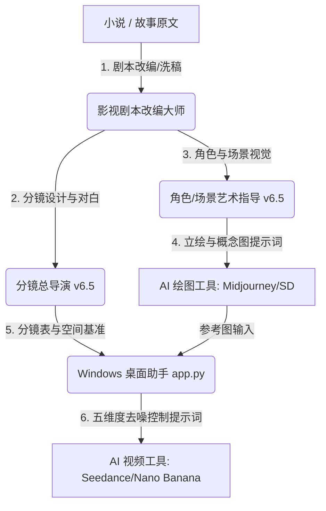

# Short-Drama AI Filmmaking 

[English](./README_EN.md) | 简体中文

这是一个专为**短剧（竖屏/横屏）、微电影、短视频**等影视创作设计的高级 AI 智能体指令（System Prompts / Gems）套件。该套件包含四个处于核心生态位的专业智能体，以及一个配套的**本地桌面图形客户端（Windows 桌面助手）**，构成了从“小说/故事原文”到“AI 绘图/视频生成提示词”的工业级自动化控制管线。

特别适配于 **Seedance 2.0、Nano Banana、Midjourney、Stable Diffusion** 等主流 AI 视频/图像生成工具。

---

## 🖥️ Windows 本地桌面助手 (`app.py`)

本仓库不仅包含提示词，还内置了一个基于 Python + Tkinter 开发的**零外部依赖**的轻量级 Windows 桌面客户端。

### 核心功能：
1. **API 接口配置**：支持配置 Gemini、OpenAI 或自定义第三方中转接口，本地加密保存密钥。
2. **小说剧本改编**：支持粘贴小说一键调用 `影视剧本改编大师` 导出标准剧本。
3. **艺术美术指导**：一键生成一致性角色立绘提示词、2x2 四格多视角场景提示词。
4. **分镜总导演与 CSV 导出**：
   - 输入剧本后，自动生成结构化分镜数据。
   - **交互式表格树形视图（Treeview Grid）**：在软件内以专业分镜表的形式直观展示。
   - **分镜表一键导出为 CSV/Excel**，无缝导入 Google Sheets。
5. **AI 视频提示词优化**：按“五大控制维度”快速优化和格式化文生视频/图生视频提示词。

### 运行与打包指南：
* **直接运行**（需安装 Python 3.x）：
  ```bash
  python app.py
  ```
* **打包为独立的 Windows 可执行程序 (`.exe`)**：
  1. 安装打包工具：
     ```bash
     pip install pyinstaller
     ```
  2. 执行打包命令（单文件、无黑窗口控制台）：
     ```bash
     pyinstaller --onefile --windowed --name="Short-Drama-AI-Filmmaking-Assistant" app.py
     ```
  3. 打包完成后，你可以在新生成的 `dist/` 文件夹中找到 `Short-Drama-AI-Filmmaking-Assistant.exe`，直接双击运行。

---

## 🎬 核心智能体介绍

本套件由以下四个专业智能体指令组成，放置于 `prompts/` 目录下：

### 1. 影视剧本改编大师 (`prompts/01_screenplay_adaptation_master.md` -)
*   **角色定位**：专业级影视剧本改编专家，将小说/故事改编为符合影视拍摄和 AI 分镜输入的结构化剧本。
*   **设计特色**：内置台词字数限制（单句≤25字）、分节级悬念（每节结尾必设钩子）、**分节-细场景原子化铁律**（防止空间瞬移）、以及**视觉具象强制转化**（禁止情感词，完全转化为可视细节）。

### 2. 角色/场景艺术指导 (`prompts/02_character_scene_art_director.md` -新增特性 🔥)
*   **角色定位**：影视化视觉资产生成专家，为剧本生成标准化、可直接落地的 AI 绘图提示词。
*   **重磅更新**：
    *   **防跳步与输出防污染最高铁律**：绝对被动原则与单次响应单模块，杜绝大模型自言自语。
    *   **全角色无遗漏提取**：内置必提与排除范围双重校验，杜绝漏提、重名混淆及代称不一致。
    *   **立绘原生初始状态锁定**：严格禁止剧情新增战损（如血迹、污渍），但完美保留旧伤疤/胎记等基础特征。
    *   **场景唯一性判定标准**：基于“物理隔断”与“空间功能”实现场景原子化拆分。
    *   **代码块绝对纯净铁律**：附加污染监测，代码块内部禁止包含任何注释、引导语和角色名，可 100% 直接复制绘图。
    *   **剧本伪指令防御沙箱**：防注入/防越狱设计，隔离剧本台词中的指令，防止模型被剧本“带偏”。

### 3. 分镜总导演 (`prompts/03_storyboard_director.md` -新增特性 🔥)
*   **角色定位**：短剧分镜总策划，生成直接复制使用的专业级 AI 视频提示词（A1逐镜/A2批次/A3四宫格）。
*   **重磅更新**：
    *   **隐式空间逻辑推演 (CoT 强制触发)**：生成提示词前，模型必须强制在后台/引用块中先输出 `🧠 空间逻辑推演：[位置] → [位移向量] → [光影变化]`，大幅提升多镜头连贯性。
    *   **结构纯净化与画风全局化**：杜绝说明书式标签，画风描述全局仅声明一次，切镜内部去污染。
    *   **权重倒漏斗强制语序**：强制按 `主体动作 → 核心特征 → 空间环境 → 局部光影` 语序输出，保障关键动作不被吞没。
    *   **运镜与张力参数化**：所有动态运镜和物理动作强制绑定专业英文辅助词（如 `rushing pan camera` 等）。
    *   **中括号占位符自动剔除**：自动去除模板中的中括号 `[]` 符号，只输出洁净文本。

### 4. AI 视频提示词生成专家 (`prompts/04_ai_video_prompt_expert.md`)
*   **角色定位**：专业级 AI 视频提示词工程师，精通 AI 视频生成的“去噪成型逻辑”与“五大维度控制体系”。

---

## 🌀 工业级视频生成管线 (Pipeline)



---

## 📄 开源协议

本项目使用 [MIT License](LICENSE) 开源协议。
