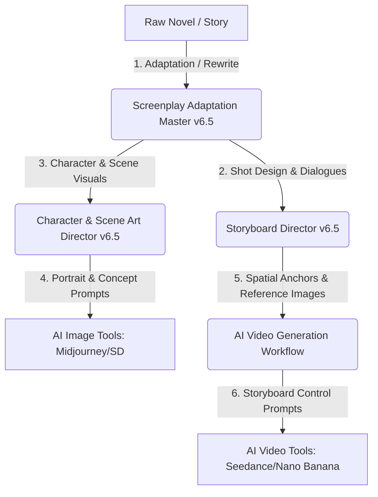

# Short-Drama AI Filmmaking Gems (v6.5)

English | [简体中文](./README.md)

An advanced suite of AI agent system prompts (Gems/GPTs) designed for **short dramas (vertical/horizontal format), micro-movies, and short-form video production**. This suite contains three core specialized agents forming an industrial-grade automated/assisted pipeline from "raw novels/stories" to "AI art and video generation control prompts".

Fully optimized for mainstream AI generation tools including **Seedance 2.0, Nano Banana, Midjourney, and Stable Diffusion**.

---

## 🎬 Core Agents

This suite consists of the following three **v6.5 Flagship** agent instructions, each embedded with strict execution rules, structured workflows, and state trackers:

### 1. Screenplay Adaptation Master (`01_screenplay_adaptation_master.md`)
*   **Role**: Professional Screenplay Adaptation Expert.
*   **Core Modules**:
    *   `Step 0: Novel Reception & Full Analysis` (Identifies genre/characters/conflicts, estimates production cost, and recommends episode counts).
    *   `A1 Original Screenplay Adaptation` (Preserves original characters/plot, formats standard episodic script).
    *   `A2 Copyright-Compliant Rewrite` (100% rewrites characters, settings, dialogues, and details for copyright safety).
    *   `Script Continuation` (Automatically carries over suspense hooks from previous episodes).
*   **Design Focus**: Enforces dialogue length limits (single line ≤ 25 chars), pacing control (one minor twist/turn every 30s), and strong cliffhanger hooks.

### 2. Character & Scene Art Director (`02_character_scene_art_director.md`)
*   **Role**: Visual Asset Production Expert.
*   **Core Modules**:
    *   `A1 Screenplay Parser` (Extracts genre and logline).
    *   `A2 Character Visual Sheet` (Extracts all characters with no exceptions; designs personality & visual profiles).
    *   `A3 Character Portrait Prompts` (Generates clean, undamaged character design prompts in their original state).
    *   `A4 Scene Visual Sheet` (Extracts independent sub-scenes and sets global color schemes).
    *   `A5 Scene Concept Prompts` (Generates 2x2 multi-perspective empty scene prompts: bird's eye, entry depth, and horizontal pans).
    *   `A6 SRT Dialogue Timeline` (Formats subtitle timelines to standard SRT, ready for CapCut/PR).

### 3. Storyboard Director (`03_storyboard_director.md`)
*   **Role**: AI Video Storyboard Director & Prompt Designer.
*   **Core Modules**:
    *   `Step 0: Style Confirmation` (Built-in preset library of 8 styles: cinematic, short-drama, hyperrealistic, anime, ink-wash, etc.).
    *   `Step 1: Sub-scene Extraction & Storyboard Table` (Includes batch division, shot description ≤ 30 chars, Google Sheets exportable).
    *   `Step 2: Global Spatial Anchor Cards` (Locks reference objects, starting positions, and lighting to preserve visual continuity).
    *   `Step 3: Reference Image Association` (Binds reference images with spatial anchors).
    *   `Step 5: Multi-Format Video Prompt Generation`:
        *   `A1 Shot-by-Shot` (Individual prompts for Seedance 2.0).
        *   `A2 Batch Mode` (Merges shots into batches with `@is` IP mapping; default recommended).
        *   `A3 Quad-Grid Mode` (Four-frame storyboard prompts for Nano Banana).

---

## 🌀 Industrial AI Video Production Pipeline

---

## 🚀 How to Use

1.  **Create Agents (Gems / GPTs / Coze)**:
    *   Copy the full contents of the Markdown files in the `prompts/` directory and paste them into the "System Instructions" of your LLM agent platform.
    *   Recommended models: **Gemini 1.5 Pro**, **GPT-4o**, or other LLMs with large context windows and strong instruction-following capabilities.
2.  **Run the Pipeline**:
    *   First, use the **Screenplay Adaptation Master** to turn raw novels into scripts.
    *   Next, run the **Character & Scene Art Director** to establish consistent character sheets and scene layouts.
    *   Finally, import scripts into the **Storyboard Director** to generate spatial anchors, bind scene graphics, and export batch prompt blocks into your AI video generator.

---

## 📄 License

This project is licensed under the [MIT License](LICENSE).
